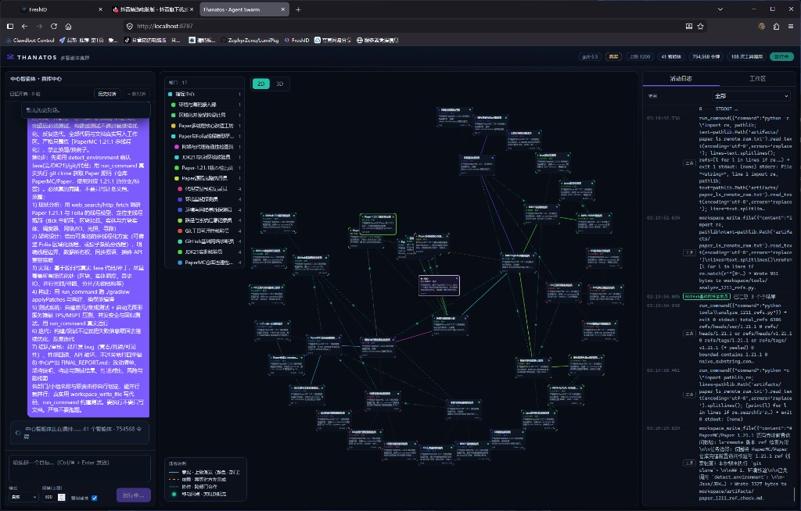

# Thanatos

**A hierarchical multi-agent system that orchestrates hundreds to thousands of LLM agents as if they were a single, far more powerful model.**

Thanatos takes one goal, has a *central agent* design an org chart for it on the fly, and recursively fans the work out across departments → sub‑teams → individual workers. The agents plan, write and edit real code, run builds and tests, use tools and MCP servers, review each other's work, and stream everything back to a live visualization dashboard.



---

## Why it exists

A single model call has a fixed budget of attention. A *team* doesn't. Thanatos treats "use a bigger model" as an orchestration problem: instead of one agent doing everything, a coordinator decomposes the task into a tree of specialized agents that run concurrently, coordinate, and synthesize their results back up the tree.

The headline capability is **scale**: a single run can spin up **hundreds to over a thousand agents** in a balanced 5-tier hierarchy, either auto-sized to the task or force-filled up to a hard cap.

```
                         中心 (Central coordinator)
                        /          |           \
                 指挥员         指挥员         指挥员          (commanders,  depth 1)
                /     \         /    \         /    \
           部门主管  部门主管  ...                              (dept leads,   depth 2)
            /   \                                              
        小组组长 小组组长 ...                                   (team leads,   depth 3)
         /  \                                                  
      工人  工人  工人 ...                                      (workers,      leaves)
```

Each node decides for itself whether to **delegate** (split into a sub-team it invents and names for the task) or **execute** (do the work directly with tools). Trivial work is done by one agent; genuinely complex areas fan out — so the org grows to fit the problem instead of wasting agents on busywork.

---

## Highlights

- **Massive, dynamic hierarchy** — central → commanders → department leads → team leads → workers. The shape, names, and headcount are generated per goal. Scales to 1000+ agents (`THANATOS_MAX_AGENTS`), with an optional **force-fill** mode that packs the org up to the cap.
- **Concurrent + ordered work** — every subtask defaults to `async` (runs in parallel); `sync` / `dependsOn` express true ordering via a dependency DAG with join barriers, so a department never returns before the work it depends on is ready.
- **Real engineering, not just chat** — agents use first-class tools: run shell commands (build/test/package), read/edit/write files in a persistent workspace (**read-before-edit**, like a real code editor), run Python, search the web, fetch URLs, and auto-detect the local toolchain (JDK / Git / Gradle / Maven / proxy).
- **MCP integration** — connect external [Model Context Protocol](https://modelcontextprotocol.io) servers (e.g. a filesystem server) and their tools are offered to every agent automatically.
- **Review & rework loop** — an LLM reviewer judges each result against the mission; failing work (off-topic, or docs-instead-of-code) is sent back for rework (打回重做).
- **Robustness** — global concurrency limiter, exponential-backoff retries at both the request and node level, a two-phase streaming timeout (generous first-token window + short idle window) that recovers from frozen upstreams without false-aborting slow reasoning, and an optional per-run token ceiling.
- **Persistence & isolation** — runs are snapshotted to disk and replayable; history and the agent workspace are isolated **per conversation**, and either can be deleted.
- **Live visualization** — a web dashboard with the central chat, a **2D/3D** swarm graph (nodes + animated data-flow edges that light up only on real activity), an activity log, and a workspace file browser. Fully localized (中文 UI).

---

## Architecture

A TypeScript / Node.js monorepo (ESM, Node ≥ 20):

| Package | Role |
| --- | --- |
| `packages/core` | The engine: orchestrator, agent loop, LLM client (streaming, OpenAI-compatible), tool registry, MCP client, prompts, event bus. |
| `packages/server` | Express + WebSocket server. REST API for runs/conversations/workspace, real-time event streaming, and it serves the built web UI. |
| `web` | React + Vite dashboard (`@xyflow/react` for the 2D graph, `three.js` for the 3D view). |

**Lifecycle of a run:** `plan` (decompose into a named sub-org) → `delegate` (spawn children with precise, file-level missions) → `execute` (leaf workers use tools to do real work) → `aggregate` (each parent synthesizes its children into one concise result) → `review` (judge & optionally rework) → the central node emits the final answer and writes `FINAL_REPORT.md` to the workspace.

---

## Quick start

```bash
# 1. Install (root workspace installs core / server / web)
npm install

# 2. Configure — copy the template and add your own key
cp .env.example .env
#   edit .env: set THANATOS_API_KEY (any OpenAI-compatible chat-completions endpoint)
#   to try it with zero network calls, set THANATOS_LLM_MODE=mock

# 3a. Dev mode (hot-reload server + Vite web)
npm run dev
#     server on :8787, web dev server proxies /api and /ws to it

# 3b. Or build + run the production server (serves the UI itself)
npm run build
npm start
#     open http://localhost:8787
```

Run the headless engine demo (mock LLM, no UI):

```bash
npm run demo
```

---

## Configuration

All configuration is via environment variables (see `.env.example` for the full list):

| Variable | Default | Purpose |
| --- | --- | --- |
| `THANATOS_API_BASE_URL` | `https://api.openai.com/v1` | OpenAI-compatible endpoint. |
| `THANATOS_API_KEY` | — | **Your key.** Lives only in `.env` (gitignored). |
| `THANATOS_MODEL` | `gpt-5.5` | Chat model id. |
| `THANATOS_LLM_MODE` | `live` | `live` or `mock` (deterministic, offline). |
| `THANATOS_MAX_AGENTS` | `1200` | Hard cap on agents per run. |
| `THANATOS_MAX_CONCURRENCY` | `8` | Max in-flight LLM requests across the whole swarm. |
| `THANATOS_REQUEST_TIMEOUT_MS` | `600000` | Total request timeout; a two-phase guard handles frozen streams. |
| `THANATOS_MAX_RETRIES` / `THANATOS_MAX_NODE_RETRIES` | `5` / `5` | Request- and node-level retries. |
| `THANATOS_MAX_TOOL_ITERATIONS` | `28` | Tool-call budget per agent (room for a real build→test→fix loop). |
| `THANATOS_ENABLE_REVIEW` / `THANATOS_MAX_REWORKS` | `true` / `1` | Reviewer + rework loop. |
| `THANATOS_ENABLE_SHELL_TOOL` / `THANATOS_ENABLE_PYTHON_TOOL` / `THANATOS_ENABLE_WEB_SEARCH_TOOL` | `true` | Toggle agent tools. |
| `THANATOS_WORKSPACE_DIR` | `./workspace` | Persistent, per-conversation agent workspace. |
| `THANATOS_PORT` | `8787` | Server port. |

Optional: copy `mcp.config.example.json` → `mcp.config.json` to attach external MCP tool servers.

---

## Status

Experimental research project. Running in `live` mode against hundreds of agents makes a large number of real model calls and can be slow and token-expensive — start small (`THANATOS_LLM_MODE=mock`, or a low `规模`/scale in the UI) before scaling up. No API key or secret is committed to this repository; `.env` is gitignored and `.env.example` ships placeholders only.
